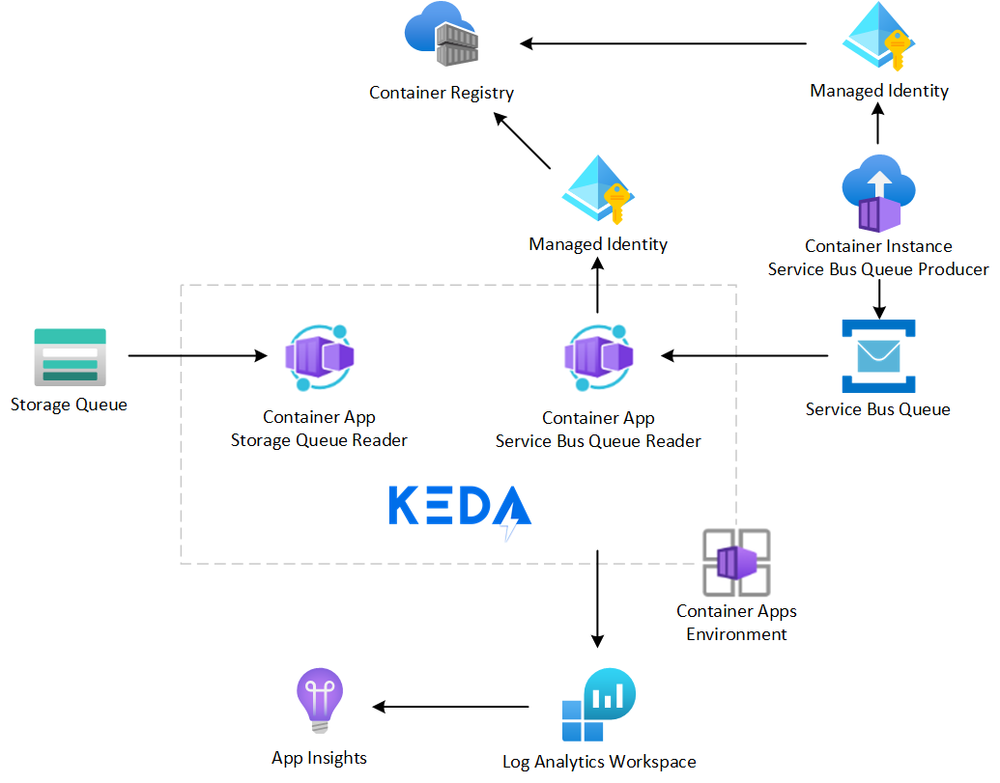

# keda-aca-queue-scalers-demo

Demo for Kubernetes Event Driven Architecture with Azure Containers Apps and Queues Scalers supported in Azure

## Overview

This repository contains a workflow that performs the following actions:

- Provision an [Azure Container Registry][acr] and build 2 container images:
  - Service Bus Queue Producer: publishes a number of messages in batch to a Service Bus Queue
  - Service Bus Queue Reader: reads a Service Bus Queue messages and logs its ID and content
- Provision an [Azure Container Apps Environment][aca] with 2 applications:
  - Storage Queue Reader, from public [Microsoft Artifact Registry][mcr]
  - Service Bus Queue Reader, from the previously deployed [Azure Container Registry][acr]
- Performs tests by putting messages in the corresponding queues:
  - Using the [Azure CLI][cli] for [Storage Queue][asq]
  - Using the Service Bus Queue Producer application hosted in an [Azure Container Instance][aci]
- Validates the expected number of messages have been processed via query to [Log Analytics Workspace][law]
- Destroy the resouce group where all resources were provisioned

## Required

If you wish to fork and use this repository, you need a secret called **AZURE_CREDENTIALS** with the credentials for a [Service Principal][sp] that will have access to an Azure subscription to deploy the solution, it will require at least Collaborator at the subscription level and will need to be able to create [Managed Identities][msi].

You will also need to update the **SUBSCRIPTIONID** environment variable in the workflow to match the Azure subscription.

[acr]: https://learn.microsoft.com/en-us/azure/container-registry/
[aca]: https://learn.microsoft.com/en-us/azure/container-apps/
[mcr]: https://mcr.microsoft.com/
[cli]: https://learn.microsoft.com/en-us/cli/azure/
[asq]: https://learn.microsoft.com/en-us/azure/storage/queues/
[aci]: https://learn.microsoft.com/en-us/azure/container-instances/
[law]: https://learn.microsoft.com/en-us/azure/azure-monitor/logs/log-analytics-workspace-overview
[sp]: https://learn.microsoft.com/en-us/cli/azure/ad/sp?view=azure-cli-latest#az-ad-sp-create-for-rbac
[msi]: https://learn.microsoft.com/en-us/azure/active-directory/managed-identities-azure-resources/
